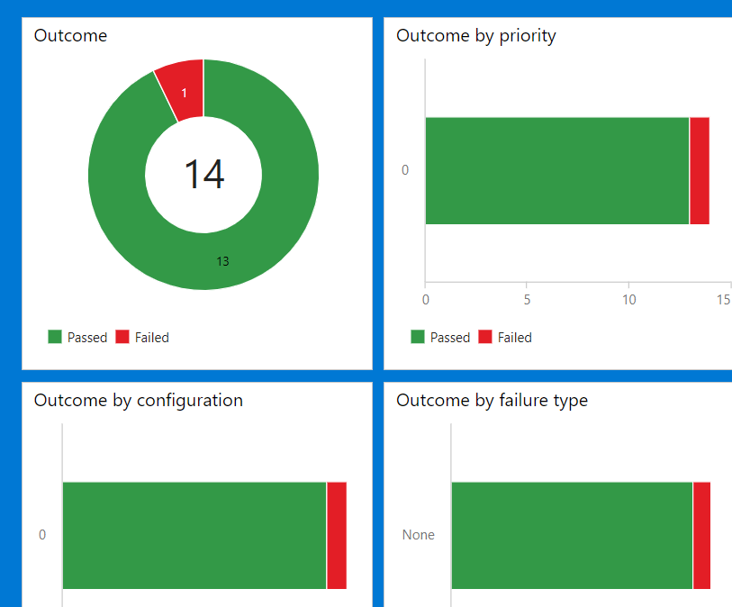
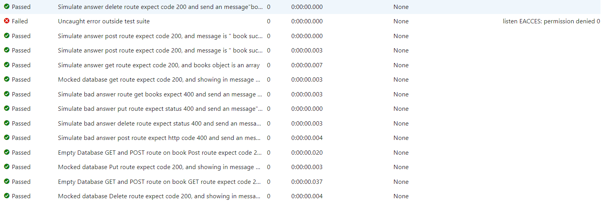
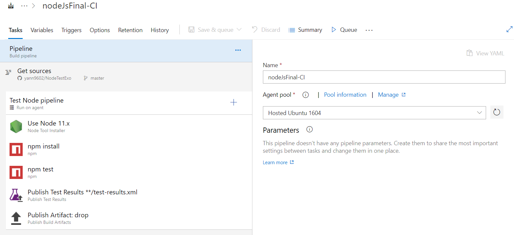
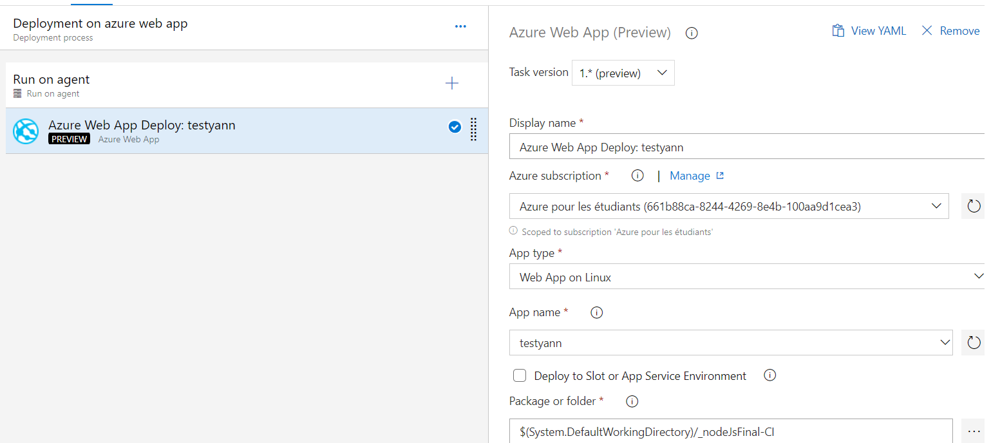

# NodeTestExo

Tout les tests sont éxécuter sur Azure devOps avec un hook direct sur la master de ce dépot github

Une pipeline est lancé automatiquement :

Un environmement Ubuntu 16.04 est initialisé  pour lancer la pipeline suivante (image 1) qui renvoie les test sur l'interface dédié (image 2/3). On peut voir que tous les tests sont réussi ( l'info en failed est hors test, l'erreur est une erreur EACESS, we don't know why x) )

A la fin de la pipeline un dossier avec le build est créer, il est zip et automatiquement enregistrer ce qui permet de garder tous les builds packagés.

Pour finir automatiquement le package est déployé sur une application azure

